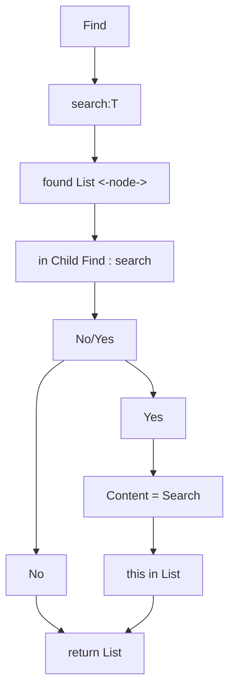

# Array vs List

## Array

Array vom Typ T 
T hat den Speicherbedarf S 


## Liste

Liste vom Typ T 

| prev        | next          |
| ------------- |:-------------:|
| <--     | -->|

verweis 

s = T 	


```mermaid
sequenceDiagram;
    participant Alice;
    participant Bob;
    Alice->>John: Hello John, how are you?;
    loop Healthcheck;
        John->>John: Fight against ;hypochondria;
    end;
    Note right of John: Rational thougts;
    <br/>prevail..;
    John-->>Alice: Great!;
    John->>Bob: How about you?;
    Bob-->>John: Jolly good!;
```
