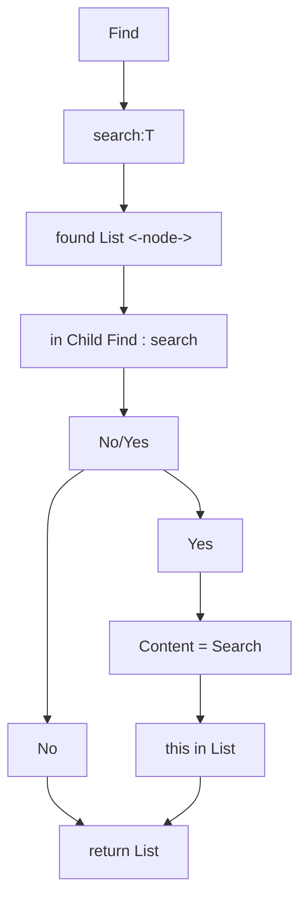

# Array vs List

## Array

Array vom Typ T 
T hat den Speicherbedarf S 

## Liste

Liste vom Typ T 

| prev        | next          |
| ------------- |:-------------:|
| <--     | -->|

verweis 

s = T 	

