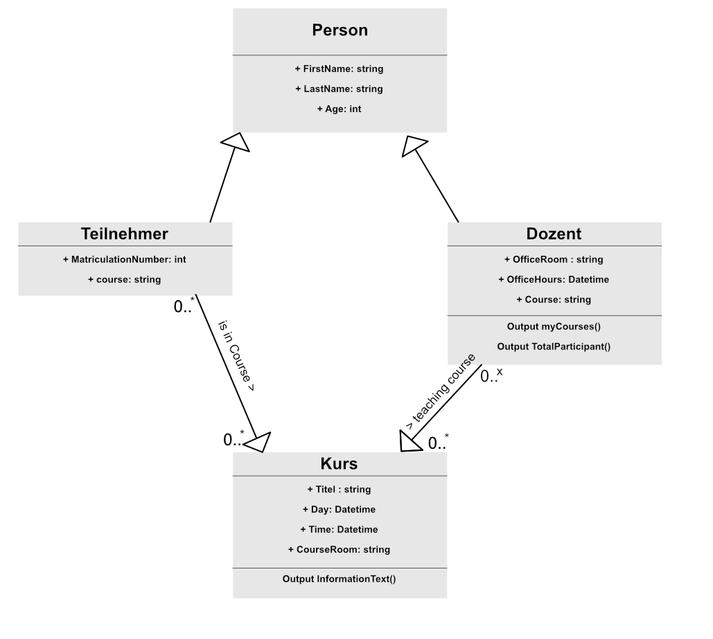

# Aufgabe UML Diagramm.

## Klassendiagramm

> Implementiert das Klassendiagramm in C#
>
> Es gibt mehrere Möglichkeiten, die kennt Beziehungen zu implementieren. Welche sind geeignet?

<!-- **ANTWORT**

Die Implementieren wird am besten über das Interface gemacht, da am Ende der Kurs von Dozent und Teilnehmer erbt, und dies über die normale Klassenvererbung nicht zu bewerkstelligen ist  -->